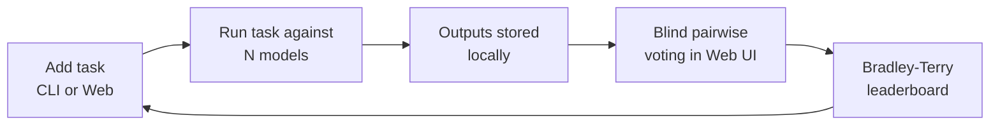
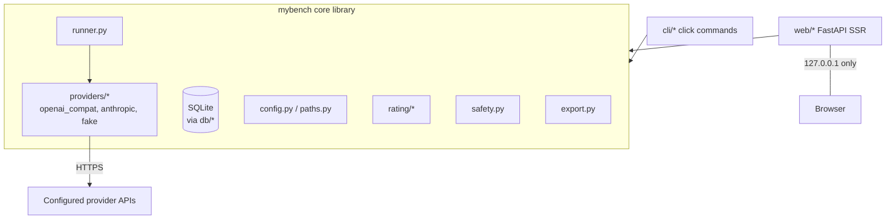

# mybench — v1 Design Document

Date: 2026-07-08
Status: Canonical design for v1. This file is the source of truth for
implementation. Issue drafts in `docs/issues/` reference sections here as
"DESIGN §N". Changes to product behavior must land here first.

Related documents:

- `docs/ISSUE_PLAN.md` — execution plan derived from this design
- `docs/decisions/ADR-001..006` — architecture decisions and their rationale
- `docs/research/*.md` — evidence backing the decisions

---

## 1. Overview and goals

**mybench** is a local, single-user tool that builds a *private LLM
leaderboard from the user's own real tasks*. The user registers prompts they
actually use, runs them against several configured models at once, votes on
anonymized output pairs (blind A/B), and gets a Bradley-Terry ranking that
reflects *their* preferences on *their* work — not a public benchmark's.

Product loop:



Design values, in priority order:

1. **Privacy** — real prompts are sensitive. Everything stays on the machine;
   the only network egress is to explicitly configured model providers.
2. **Blindness integrity** — the tool, not user discipline, enforces that
   votes are cast without knowing which model wrote what.
3. **Data ownership** — raw votes/outputs are inspectable, exportable,
   deletable; ratings are always recomputable from raw data.
4. **Auditability** — small dependency tree, explicit SQL, no magic; suitable
   for OSS security review.

Naming: product, repo, PyPI package, and CLI are all `mybench` (ADR-001).

## 2. Scope

### 2.1 v1 scope

- Single-turn text tasks: optional system prompt + user prompt + sampling
  params (temperature, top_p, max_tokens).
- Providers: generic OpenAI-compatible adapter, native Anthropic adapter,
  deterministic `fake` adapter for tests/demos (ADR-004).
- Concurrent run execution with per-model timeout/retry and partial-failure
  tolerance.
- Blind pairwise voting (4 outcomes: A / B / tie / both bad) with position
  randomization, least-voted-pair scheduling, reveal-after-vote, and a
  blindness integrity flag on every vote.
- Bradley-Terry leaderboard with bootstrap confidence intervals, global and
  per-category, connected-component handling (ADR-003).
- CLI (`mybench`) and local web UI (SSR, 127.0.0.1 only) over one SQLite DB.
- JSON/CSV export.
- Security posture per §13 (ADR-005).

### 2.2 v1 non-goals

- No multi-user, auth, remote access, TLS serving, or team features.
- No streaming token display; runs are background jobs, votes come later.
- No LLM-as-judge; humans vote (Q8-A).
- No automatic capture of tasks from proxies or agent session logs (Q2-A).
- No multi-turn conversations, attachments, images, or tool calls.
- No cost (money) estimation — token counts are stored, pricing tables are not.
- No import of exported data (export is one-way in v1).
- No task editing or hard deletion: tasks are archive-only once created,
  because runs/votes reference their exact prompt text (edit = archive +
  recreate).
- No Windows support commitment (POSIX: macOS/Linux; Windows untested).

### 2.3 v2 deferred ideas (recorded, not designed)

OpenAI-compatible capture proxy; session-log importers (Codex/Claude Code);
LLM-as-judge with disclosure flags; multi-turn tasks; streaming; style/length
controls in rating; cost estimation; import/merge; syntax highlighting;
Gemini native adapter; encrypted-at-rest DB.

## 3. System architecture

Two entry points (CLI process, web server process) share one library core and
one SQLite database. The web server is a single uvicorn process with one
worker (ADR-002); the CLI may run concurrently (WAL, ADR-006).



### 3.1 Module layout (authoritative)

```
src/mybench/
├── __init__.py            # __version__
├── paths.py               # XDG path resolution (§5.1)
├── config.py              # TOML load + validation (§5.2–5.4)
├── safety.py              # limits, ANSI stripping, redaction (§5.5, §13)
├── db/
│   ├── __init__.py        # connect(), tx() helpers (§4.1)
│   ├── migrations.py      # numbered migrations (§4.2)
│   ├── tasks.py           # task repository (§4.4)
│   ├── runs.py            # run/output repository (§4.4)
│   └── votes.py           # vote repository + pair selection (§4.4, §8)
├── providers/
│   ├── __init__.py        # registry: build(model_cfg, settings) (§6.4)
│   ├── base.py            # request/result/error types, Provider protocol (§6.1–6.3)
│   ├── openai_compat.py   # §6.5
│   ├── anthropic.py       # §6.6
│   └── fake.py            # §6.7
├── runner.py              # run execution engine (§7)
├── rating/
│   ├── __init__.py
│   ├── bradley_terry.py   # MM estimator (§9.2–9.4)
│   ├── bootstrap.py       # CI computation (§9.5)
│   └── leaderboard.py     # row assembly, components, filters (§9.6)
├── export.py              # JSON/CSV export (§10.9)
├── cli/
│   ├── __init__.py
│   ├── main.py            # click group, --verbose, exit-code policy (§10)
│   ├── models_cmd.py
│   ├── task_cmd.py
│   ├── run_cmd.py
│   ├── leaderboard_cmd.py
│   ├── export_cmd.py
│   └── serve_cmd.py
└── web/
    ├── __init__.py
    ├── app.py             # create_app() factory (§11.1)
    ├── security.py        # host allowlist, headers, CSRF (§13.3–13.5)
    ├── render.py          # markdown sanitize pipeline (§12)
    ├── runs_manager.py    # in-process run tracking (§11.6)
    ├── routes/
    │   ├── dashboard.py   ├── tasks.py   ├── runs.py
    │   ├── vote.py        ├── leaderboard.py  └── history.py
    ├── templates/         # base.html + one per page (§11.3)
    └── static/            # app.css, vote.js, runstatus.js (§11.4)
```

Tests live in `tests/` mirroring module names (`tests/test_config.py`, ...).

## 4. Data model and storage

### 4.1 Connection policy

`mybench.db.connect(db_path: Path) -> sqlite3.Connection`:

- `row_factory = sqlite3.Row`
- `PRAGMA journal_mode=WAL`, `PRAGMA foreign_keys=ON`,
  `PRAGMA busy_timeout=5000`
- Callers use the `tx(conn)` context manager (BEGIN IMMEDIATE … COMMIT/ROLLBACK).
  Write transactions must stay short: never hold a transaction across a
  network call.
- Timestamps are UTC ISO-8601 strings with `Z` suffix generated in Python
  (`datetime.now(timezone.utc).strftime('%Y-%m-%dT%H:%M:%S.%f')[:-3] + 'Z'`),
  injectable in tests (ADR-006).

### 4.2 Migrations

`mybench/db/migrations.py` defines `MIGRATIONS: list[tuple[int, str]]`.
`apply_migrations(conn)` creates `schema_migrations(version INTEGER PRIMARY
KEY, applied_at TEXT NOT NULL)` if absent, then applies each version >
current max inside one transaction per version. Called on every process start
(CLI and server). Migration 0001 is frozen once merged; schema changes are new
entries.

### 4.3 Schema (migration 0001)

```sql
CREATE TABLE tasks (
  id            INTEGER PRIMARY KEY AUTOINCREMENT,
  title         TEXT,                          -- display name; NULL → derived from prompt head
  category      TEXT NOT NULL DEFAULT 'general',
  system_prompt TEXT,
  user_prompt   TEXT NOT NULL,
  params_json   TEXT NOT NULL DEFAULT '{}',    -- {"temperature":..,"top_p":..,"max_tokens":..}
  created_at    TEXT NOT NULL,
  archived_at   TEXT                           -- soft archive; NULL = active
);

CREATE TABLE runs (
  id            INTEGER PRIMARY KEY AUTOINCREMENT,
  task_id       INTEGER NOT NULL REFERENCES tasks(id),
  status        TEXT NOT NULL CHECK (status IN ('running','completed')),
  params_json   TEXT NOT NULL,                 -- effective params for this run
  created_at    TEXT NOT NULL,
  completed_at  TEXT,
  revealed_at   TEXT                           -- §8.5 blindness; NULL = still blind
);

CREATE TABLE outputs (
  id                  INTEGER PRIMARY KEY AUTOINCREMENT,
  run_id              INTEGER NOT NULL REFERENCES runs(id),
  model_id            TEXT NOT NULL,           -- config slug (§5.3)
  model_snapshot_json TEXT NOT NULL,           -- {"provider":..,"base_url":..,"model":..,"params":{..}}
  status              TEXT NOT NULL CHECK (status IN ('pending','succeeded','failed')),
  content             TEXT,                    -- NULL unless succeeded
  error               TEXT,                    -- NULL unless failed; sanitized message
  finish_reason       TEXT,
  prompt_tokens       INTEGER,
  completion_tokens   INTEGER,
  latency_ms          INTEGER,
  created_at          TEXT NOT NULL,
  finished_at         TEXT
);

CREATE TABLE votes (
  id            INTEGER PRIMARY KEY AUTOINCREMENT,
  run_id        INTEGER NOT NULL REFERENCES runs(id),
  output_a_id   INTEGER NOT NULL REFERENCES outputs(id),  -- shown LEFT
  output_b_id   INTEGER NOT NULL REFERENCES outputs(id),  -- shown RIGHT
  winner        TEXT NOT NULL CHECK (winner IN ('a','b','tie','both_bad')),
  blind         INTEGER NOT NULL DEFAULT 1 CHECK (blind IN (0,1)),  -- §8.5
  note          TEXT,
  created_at    TEXT NOT NULL,
  CHECK (output_a_id <> output_b_id)
);

CREATE INDEX idx_runs_task       ON runs(task_id);
CREATE INDEX idx_outputs_run     ON outputs(run_id);
CREATE INDEX idx_votes_run       ON votes(run_id);
CREATE INDEX idx_votes_outputs   ON votes(output_a_id, output_b_id);
CREATE INDEX idx_tasks_category  ON tasks(category);
```

### 4.4 Repository layer

Repositories expose typed functions taking/returning frozen dataclasses
(`Task`, `Run`, `Output`, `Vote`, defined in the respective repo modules).
**Ownership rule:** all writes/mutations to a table live in its repository
module only; read-only cross-table joins are allowed where this design
mandates them (e.g. pair selection joins `outputs`/`runs`/`tasks`, export
dumps read all tables). Key functions (signatures normative):

- `tasks.create(conn, *, title, category, system_prompt, user_prompt, params, now=None) -> Task`
- `tasks.get(conn, task_id) -> Task | None`, `tasks.list_(conn, *, category=None, include_archived=False) -> list[Task]`
- `tasks.run_counts(conn, task_ids) -> dict[int, int]`,
  `tasks.list_categories(conn) -> list[str]` (distinct, sorted)
- `tasks.archive(conn, task_id, now=None) -> bool` / `tasks.unarchive(conn, task_id) -> bool`
- `runs.create_with_outputs(conn, *, task_id, params_json: str, model_snapshots: Sequence[tuple[str, str]], now=None) -> Run`
  (one transaction: run row + one pending output per `(model_id, snapshot_json)`;
  the returned `Run` carries `outputs: tuple[Output, ...]` ordered as passed)
- `runs.finish_output(conn, output_id, *, status, content=None, error=None, finish_reason=None, prompt_tokens=None, completion_tokens=None, latency_ms=None, now=None)`
  (sets `finished_at`; unknown id → `ValueError`)
- `runs.complete(conn, run_id, now=None)` (guarded: only from `running`),
  `runs.reveal(conn, run_id, now=None) -> bool`
- `runs.get(conn, run_id) -> Run | None`, `runs.outputs_of(conn, run_id) -> list[Output]`,
  `runs.list_runs(conn, *, task_id=None, limit=50) -> list[RunListItem]`,
  `runs.status_counts(conn, run_id) -> dict[str, int]`, `runs.count(conn) -> int`
- `runs.sweep_orphans(conn, *, older_than_hours=1, now=None) -> int` (§7.4)
- `votes.create(conn, *, run_id, output_a_id, output_b_id, winner, note=None, now=None) -> Vote`
  — `blind` is computed **inside the transaction** from `runs.revealed_at`
  (§8.5); callers never pass it
- `votes.delete(conn, vote_id) -> bool`
- `votes.next_pair(conn, *, category=None, task_id=None, run_id=None) -> Pair | None` (§8.3)
- `votes.unvoted_pair_count(conn, ...) -> int`,
  `votes.counts(conn) -> tuple[int, int]` (blind, non-blind totals)
- `votes.list_votes(conn, *, limit=100) -> list[VoteListItem]`
- `votes.games(conn, *, category=None, include_nonblind=False) -> list[Game]`
  (vote rows joined to model ids, for rating §9.1)
- `db.dump_all(conn) -> dict[str, list[dict]]` — read-only full-table dump for
  export (§10.9); table set fixed to the four §4.3 tables

All timestamps accepted via optional `now: str | None` (§4.1 format) for test
injection; `None` → `utc_now_iso()`.

## 5. Configuration and paths

### 5.1 Paths (XDG on all POSIX platforms, deliberately including macOS)

| Item | Resolution order |
|---|---|
| Config file | `$MYBENCH_CONFIG` → `$XDG_CONFIG_HOME/mybench/config.toml` → `~/.config/mybench/config.toml` |
| Data dir | `$MYBENCH_DATA_DIR` → `$XDG_DATA_HOME/mybench` → `~/.local/share/mybench` |
| DB file | `{data_dir}/mybench.db` |

Env var handling: empty-string values are treated as unset (fall through);
values are normalized with `Path(v).expanduser().resolve(strict=False)`
(relative paths resolve against CWD). CLI global options (`--config`,
`--data-dir`, §10.1) take precedence over env vars.

`paths.py` exposes `config_path() -> Path`, `data_dir() -> Path`,
`db_path() -> Path`. `data_dir()` creates the directory (missing parents
created as needed) with mode `0700`, tightens the final directory's
permissions if wider, never chmods ancestors, and raises if the path exists
but is not a directory (§13.7). `config_path()` has no side effects.

### 5.2 Config file format

```toml
# ~/.config/mybench/config.toml
[settings]
port = 8137                 # web UI port (default 8137)
timeout_seconds = 120       # per-model completion timeout (default 120, 1..3600)
max_concurrency = 4         # parallel provider calls per run (default 4, 1..16)
bootstrap_samples = 200     # rating CI resamples (default 200, 0..1000; 0 disables CI)

[[models]]
id = "gpt-5.2"                        # stable slug; identity on the leaderboard
provider = "openai_compat"
base_url = "https://api.openai.com/v1"
model = "gpt-5.2"
api_key_env = "OPENAI_API_KEY"
enabled = true

[[models]]
id = "sonnet"
provider = "anthropic"
# base_url defaults to https://api.anthropic.com
model = "claude-sonnet-5"
api_key_env = "ANTHROPIC_API_KEY"

[[models]]
id = "qwen-local"
provider = "openai_compat"
base_url = "http://localhost:11434/v1"   # http allowed: loopback only
model = "qwen3:14b"
# api_key_env optional for loopback base_url
```

### 5.3 Validation rules (config.load() must enforce; errors prefixed `config error:`)

| Field | Rule |
|---|---|
| `models[].id` | required; regex `^[a-z0-9][a-z0-9._-]{0,63}$`; unique across file |
| `models[].provider` | one of `openai_compat`, `anthropic`, `fake` |
| `models[].model` | required non-empty string (except `fake`: optional) |
| `models[].base_url` | `openai_compat`: required; `anthropic`: optional — **normalized to `https://api.anthropic.com` at load time** so adapters always see a value; `fake`: forbidden. Scheme `https` or `http`; `http` only when host ∈ {`localhost`,`127.0.0.1`,`::1`} else error |
| `models[].api_key_env` | env var *name* (regex `^[A-Z][A-Z0-9_]*$`). Required for `anthropic` and for `openai_compat` with non-loopback base_url; optional for loopback; forbidden for `fake`. A literal `api_key` field anywhere → error telling the user to use `api_key_env` |
| `models[].enabled` | bool, default `true` |
| `settings.*` | ranges as in §5.2 comments; unknown keys in `[settings]` or model entries → error (typo protection) |
| file | missing file → defaults with zero models (commands needing models fail with pointer to `mybench init`); unreadable/invalid TOML → error |

Loaded config is exposed as frozen dataclasses `Settings` and
`ModelConfig`; `Config.enabled_models` preserves file order. The API key
*value* is read from the environment lazily at provider-build time; a missing
env var at run time is a per-model provider `auth` error, not a config error.
Config error messages name the TOML location and the violated rule but never
echo the raw value of secret-adjacent fields (`api_key`, `api_key_env`).

### 5.4 Task parameter validation (shared by CLI/web forms)

| Param | Rule |
|---|---|
| `user_prompt` | required, 1..200,000 chars |
| `system_prompt` | optional, ≤ 50,000 chars |
| `title` | optional, ≤ 200 chars; display fallback = first 80 chars of user_prompt |
| `category` | slug `^[a-z0-9][a-z0-9-]{0,31}$`, default `general` |
| `temperature` | optional float 0..2 |
| `top_p` | optional float 0..1 |
| `max_tokens` | optional int 1..128000 |
| vote `note` | optional, ≤ 2,000 chars |

### 5.5 Safety utilities (`safety.py`)

- `strip_terminal_controls(s: str) -> str` — removes ANSI/CSI/OSC escape
  sequences and C0 control chars except `\n` and `\t`. Applied to **any**
  model- or task-originated text echoed to a terminal (§13.6).
- `truncate(s, limit, marker="…[truncated]")` — result length ≤ `limit`;
  when `limit <= len(marker)` the result is `marker[:limit]`.
- `redact(s: str, replacements: Sequence[tuple[str, str]]) -> str` — replaces
  each `(secret_value, replacement)` pair, longest secret first.
- `install_redaction_filter(secret_env_vars: Sequence[str]) -> None` — wraps
  the formatter of every root-logger handler with a `RedactingFormatter`
  that applies `redact` to the **fully formatted record** (message, args,
  and exception traceback text) using replacement `[REDACTED:{ENV_NAME}]`
  per env var. Installed at process start by both entry points (§14).
  Idempotent.
- `validate_task_params(...) -> list[str]` — §5.4 task-parameter rules with
  exact user-facing messages (single source; CLI/web render them verbatim).
  The vote-note limit constant lives here; note length is enforced in
  `votes.create` (§4.4).
- Limit constants from §5.4 live here (single source).

## 6. Provider layer

### 6.1 Request/result types (`providers/base.py`)

```python
@dataclass(frozen=True, slots=True)
class CompletionRequest:
    system_prompt: str | None
    user_prompt: str
    temperature: float | None
    top_p: float | None
    max_tokens: int | None

@dataclass(frozen=True, slots=True)
class CompletionResult:
    content: str                    # non-empty; empty content → invalid_response error
    finish_reason: str | None       # provider string, passed through; "length"/"max_tokens" → truncated flag in UI
    prompt_tokens: int | None
    completion_tokens: int | None
    latency_ms: int
    raw_model: str | None           # model name echoed by the API, if any

@dataclass(frozen=True, slots=True)
class CheckResult:
    ok: bool
    message: str                    # "ok (312 ms)" or sanitized error
    latency_ms: int | None
```

### 6.2 Error taxonomy

```python
class ProviderErrorKind(str, enum.Enum):
    auth = "auth"                       # 401/403, missing env var
    rate_limit = "rate_limit"           # 429
    timeout = "timeout"                 # asyncio/httpx timeout
    connection = "connection"           # DNS/refused/TLS failures
    invalid_response = "invalid_response"  # unparsable/empty/unexpected shape
    content_too_large = "content_too_large" # §6.8 size cap
    api_error = "api_error"             # other 4xx/5xx

class ProviderError(Exception):
    kind: ProviderErrorKind
    message: str          # sanitized: never contains header values or key material
    status_code: int | None
    retryable: bool       # True only for rate_limit, 5xx api_error, connection

    @classmethod
    def from_status(cls, status_code: int, message: str) -> "ProviderError":
        # 401/403 -> auth; 429 -> rate_limit; >=500 -> api_error retryable;
        # other 4xx -> api_error non-retryable
        ...
```

Message hygiene is layered: the constructor control-strips and truncates
(300 chars) every message; network adapters must additionally scrub the
resolved API key value from any provider-derived text (error bodies, debug
logs) *before* constructing errors — a hostile provider may echo the
`Authorization` header back (§13.1 B4).

### 6.3 Provider protocol

```python
class Provider(Protocol):
    model_config: ModelConfig
    async def complete(self, request: CompletionRequest) -> CompletionResult: ...
    async def check(self) -> CheckResult: ...   # 1-token real completion ("ping"), §10.4
    async def aclose(self) -> None: ...         # release transport resources; no-op for fake
```

### 6.4 Registry (`providers/__init__.py`)

`PROVIDERS: dict[str, type]` mapping the config `provider` string to the
adapter class; `build(model_cfg: ModelConfig, settings: Settings) -> Provider`
resolves the API key env var (raising `ProviderError(kind=auth)` with the env
var *name* in the message if required-but-unset) and constructs the adapter
with a shared-per-call `httpx.AsyncClient` policy (§6.8).

### 6.5 `openai_compat` adapter

- `POST {base_url}/chat/completions` with `Authorization: Bearer {key}` (omit
  header if no key configured for loopback), body per
  `docs/research/provider-api-variance.md` §2, `stream: false`. Omit
  `temperature`/`top_p`/`max_tokens` keys when `None`.
- Parse `choices[0].message.content`: string → use as-is; list → concatenate
  `part["text"]` where `part["type"] == "text"`; anything else →
  `invalid_response`. Empty/whitespace-only content → `invalid_response`.
- `usage.prompt_tokens` / `usage.completion_tokens` optional → `None`.
- Error mapping: 401/403→auth; 429→rate_limit; other status →
  api_error(retryable = status ≥ 500); JSON error body `error.message`
  extracted best-effort, truncated to 300 chars, control-stripped.

### 6.6 `anthropic` adapter

- `POST {base_url}/v1/messages`, headers `x-api-key`, `anthropic-version:
  2023-06-01`. Top-level `system` when present. **`max_tokens` required by the
  API**: use request value or adapter default `4096`.
- Content: concatenate `text` of blocks with `type == "text"`;
  `usage.input_tokens`/`output_tokens`; `stop_reason` recorded as
  finish_reason (`max_tokens` → truncated flag).
- Same error mapping; honor `retry-after` header on 429.

### 6.7 `fake` adapter

Deterministic, offline: content =
`"fake output from {model_id} for prompt sha256:{hash12}\n\n" + fixed 2-paragraph filler`;
`finish_reason="stop"`, tokens = `len(prompt)//4` / fixed 128, latency 1 ms.
`check()` always ok. Purpose: tests, demos, screenshots (ADR-004).

### 6.8 Transport policy (both network adapters)

- One `httpx.AsyncClient` per adapter instance, built by the shared helper
  `providers.base.default_client(settings)`; TLS verify always on;
  `follow_redirects=False` — any 3xx response maps to
  `ProviderError(kind=connection, retryable=False, message="redirect
  response not allowed")`.
- Timeouts: connect 10 s; total budget = `settings.timeout_seconds` enforced
  by the runner via `asyncio.timeout` (§7.2); httpx read timeout set to the
  same value.
- Response size cap 5 MB: check `Content-Length` when present; otherwise read
  streamed with a running total; exceeding → `content_too_large`.
- Retry policy: at most **1** retry, only when `retryable` (429, 5xx,
  connection). Backoff: `Retry-After` seconds if present (cap 30) else
  `2 + random.uniform(0, 1)` s. No retry on timeout.

## 7. Run execution engine (`runner.py`)

### 7.1 Entry point

```python
async def execute_run(
    conn: sqlite3.Connection,          # runner owns short write txs on it
    config: Config,
    *,
    task: Task,
    model_ids: list[str],              # engine validation is authoritative (≥2 after dedup,
                                       # known+enabled, task not archived); callers may
                                       # pre-validate for friendlier messages
    param_overrides: dict | None = None,
    progress: Callable[[OutputEvent], None] | None = None,   # CLI progress lines
    on_created: Callable[[int], None] | None = None,         # fired with run_id right after rows exist (web §11.6)
) -> RunSummary                        # (run_id, succeeded, failed, latency stats)
```

Effective params = task.params overridden by `param_overrides` (validated per
§5.4). Snapshot per model written to `outputs.model_snapshot_json`.

### 7.2 Execution

1. One transaction: create `runs` row (`status='running'`) + one `pending`
   output per model (§4.4 `create_with_outputs`).
2. `asyncio.Semaphore(settings.max_concurrency)`; for each model, a coroutine:
   build provider → `asyncio.timeout(settings.timeout_seconds)` around
   `complete(CompletionRequest(...))` built from the task's prompts + the
   effective params → on success/failure, its own short transaction via
   `finish_output`; `finally: await provider.aclose()`. Persisted failure
   text is exactly `ProviderError.message` (already sanitized per §6.2);
   unexpected exceptions persist `invalid_response: {ClassName}` (no
   traceback in DB; traceback goes to DEBUG logs only).
3. `asyncio.gather(..., return_exceptions=True)` — one model's failure never
   cancels others.
4. Final transaction: `runs.complete()` sets `status='completed'`,
   `completed_at`.

### 7.3 State machine

| Entity | States | Transitions |
|---|---|---|
| run | `running` → `completed` | created running; completed when all outputs terminal. Terminal. |
| output | `pending` → `succeeded` \| `failed` | exactly one transition, in one tx. Terminal. |

A run with < 2 succeeded outputs is *completed but not votable*; UI/CLI must
say so explicitly (run page banner; CLI exit code 2, §10.6).

### 7.4 Orphan recovery

A killed process can leave `pending` outputs. `runs.sweep_orphans(conn,
older_than_hours=1)`: mark `pending` outputs of runs with `created_at <
now-1h` as `failed` (`error='orphaned: process terminated'`) and complete
those runs. Called at CLI startup (before any command touching the DB) and at
web server startup. Returns count swept; log at INFO when > 0.

### 7.5 Concurrent processes

CLI `mybench run` and the web server may execute runs simultaneously in
different processes. Safety comes from WAL + short transactions (§4.1); no
cross-process run registry exists in v1 (§18).

## 8. Voting and pair selection

### 8.1 Definitions

- A **pair** is an unordered set of two `succeeded` outputs from the *same
  run*: `{min(id), max(id)}`.
- A pair's **vote count** counts votes matching both output ids regardless of
  stored display order.

### 8.2 Eligibility

Pairs are eligible for the vote queue when: task not archived, both outputs
succeeded. Optional filters narrow the queue: `category`, `task_id`, `run_id`.
Already-voted pairs stay eligible (re-voting is legitimate re-evaluation over
time) but sort after unvoted pairs (§8.3).

### 8.3 Scheduling: least-voted first

`votes.next_pair()` (normative SQL, filters appended as `AND` clauses):

```sql
WITH pairs AS (
  SELECT o1.id AS lo_id, o2.id AS hi_id, r.id AS run_id
  FROM outputs o1
  JOIN outputs o2 ON o1.run_id = o2.run_id AND o1.id < o2.id
  JOIN runs  r ON r.id = o1.run_id
  JOIN tasks t ON t.id = r.task_id
  WHERE o1.status = 'succeeded' AND o2.status = 'succeeded'
    AND t.archived_at IS NULL
)
SELECT p.lo_id, p.hi_id, p.run_id,
       (SELECT COUNT(*) FROM votes v
         WHERE (v.output_a_id = p.lo_id AND v.output_b_id = p.hi_id)
            OR (v.output_a_id = p.hi_id AND v.output_b_id = p.lo_id)) AS vote_count
FROM pairs p
ORDER BY vote_count ASC, RANDOM()
LIMIT 1;
```

`unvoted_pair_count()` = same CTE, `COUNT(*)` where `vote_count = 0`.

### 8.4 Display and vote recording

- Application code flips a fair coin to assign `{lo,hi}` to LEFT/RIGHT;
  `votes.output_a_id` is what was shown LEFT.
- The voting page shows model outputs with neutral labels ("Response A" /
  "Response B"), the task prompt, and **no model-identifying data** (§8.6).
- Vote outcomes: `a`, `b`, `tie`, `both_bad` (+ optional note ≤ 2000 chars).
- After a successful vote POST, redirect to the next pair with a **reveal
  banner** naming the two models of the just-voted pair and the choice made.
- Votes may be deleted from history (§11, History); deletion is immediate and
  ratings reflect it on next recompute (ADR-003, ADR-006).

### 8.5 Blindness integrity

- `runs.revealed_at` marks the moment a run's model↔output mapping was shown.
- Votes created while `revealed_at IS NULL` get `blind=1`, else `blind=0`.
- Reveal happens: (a) explicitly — user clicks "Reveal models" on the run page
  (`POST /runs/{id}/reveal`); (b) implicitly at display time — the run detail
  page auto-reveals **only when** no unvoted pair remains in the run, and then
  sets `revealed_at` if still NULL.
- The leaderboard uses `blind=1` votes by default; including non-blind votes
  is an explicit toggle (§9.1, §11).

### 8.6 Blindness leak checklist (enforced by tests, issue 27/32)

The vote page response body must not contain: `model_id`, provider name,
`base_url`, `raw_model`, model snapshot fields, or output ids ordered by model
id. Output ids themselves are allowed (opaque). Latency/token counts are *not*
shown pre-vote (they can fingerprint models).

## 9. Rating and leaderboard

### 9.1 Input: games

`votes.games()` returns one game per vote:
`Game(model_lo: str, model_hi: str, score_lo: float,
kind: Literal["decisive", "tie", "both_bad"])` where `score_lo` ∈
{1.0, 0.0, 0.5} from the winner field mapped through display order (`a`
means "left output's model", so join votes → outputs → model_id) and `kind`
distinguishes tie from both_bad for display rates (§9.6) while both count 0.5
for fitting. Default `blind=1` only; `include_nonblind=True` adds the rest.
Category filter joins via run → task.

### 9.2 Estimator (`rating/bradley_terry.py`)

```python
def fit_bradley_terry(
    games: Sequence[Game],
    *,
    regularization_virtual_ties: float = 1.0,   # virtual tied games per active pair
    max_iter: int = 1000,
    tol: float = 1e-8,
) -> dict[str, float]        # model_id -> strength p_i (geometric mean 1 per component)
```

Aggregate to `w[i][j]` (fractional wins of i over j; tie/both_bad = 0.5 each)
and `n[i][j] = n[j][i]` (games). Add the virtual tie: for every pair with
`n[i][j] > 0`, `w[i][j] += 0.5; w[j][i] += 0.5; n[i][j] += 1.0`. MM update
(Hunter 2004):

```
for each model i:  p_i' = W_i / Σ_{j≠i, n_ij>0} n_ij / (p_i + p_j)
where W_i = Σ_j w_ij
```

Renormalize to geometric mean 1 per component each sweep; converged when
`max_i |p_i' - p_i| / p_i < tol`.

### 9.3 Connected components

Union-find over models joined by any game. `fit` runs per component.
Singleton models (0 games) are excluded from fitting and reported separately.

### 9.4 Display scale

`rating_i = round(400 * log10(p_i) + C_component)` with `C` chosen so the
arithmetic mean of ratings in each component is 1000. `round` is Python's
built-in (banker's rounding at .5 — acceptable; the scale is cosmetic).

### 9.5 Uncertainty (`rating/bootstrap.py`)

```python
def bootstrap_ci(games, *, samples: int = 200, seed: int | None = None,
                 confidence: float = 0.95) -> dict[str, tuple[int, int]]
```

Resample the game list with replacement (`random.Random(seed)`), refit,
collect per-model ratings (models absent from a resample are skipped for that
sample), return percentile intervals on the display scale. Percentile
algorithm (normative): sort the samples; index `k = q * (n - 1)`; linearly
interpolate between `floor(k)` and `ceil(k)`; convert with `int(round(v))`.
`samples=0` or empty games → `{}`. Performance target: full leaderboard
including CI < 2 s at 5,000 votes / 15 models / 200 samples (pure Python);
the CI test asserts < 4 s as a runner-variance guard — a measured local time
above 2 s triggers Known Unknown U4, not a silent threshold bump.

### 9.6 Leaderboard assembly (`rating/leaderboard.py`)

```python
@dataclass(frozen=True)
class LeaderboardRow:
    model_id: str
    rating: int
    ci_low: int | None
    ci_high: int | None
    games: int          # games involving the model (after filters, before regularization)
    wins: float         # fractional
    win_rate: float | None   # wins excluding ties / decisive games; None if 0 decisive
    tie_rate: float
    both_bad_rate: float
    provisional: bool   # games < 10
    component: int      # 0-based; single component → all 0

@dataclass(frozen=True)
class Leaderboard:
    rows: tuple[LeaderboardRow, ...]   # sorted: component asc, then rating desc
    components_count: int
    unrated_models: tuple[str, ...]    # known_model_ids with 0 games, sorted
    total_votes: int                   # games counted after filters, before regularization

def compute_leaderboard(conn, *, category=None, include_nonblind=False,
                        bootstrap_samples=200, seed=None,
                        known_model_ids: Sequence[str] | None = None) -> Leaderboard
```

No caching in v1: recompute per request (ADR-003). CLI and web both call this.

## 10. CLI specification

### 10.1 Global behavior

- Entry point: console script `mybench` → `mybench.cli.main:cli` (click group).
- Global options: `--verbose/-v` (DEBUG logging), `--config PATH` (override
  config file), `--data-dir PATH` (override data dir).
- Every command: apply migrations + orphan sweep before doing DB work.
- Exit codes: `0` success; `1` error (config error, provider fatal, bad args);
  `2` command-specific partial state (documented per command). Errors go to
  stderr prefixed `error: `; `--json` commands emit machine-readable output on
  stdout only.
- **All model/task-originated text echoed to the terminal passes through
  `safety.strip_terminal_controls`** (§13.6).

### 10.2 `mybench init`

Creates the config file with the commented template of §5.2 (models section
commented out) if absent; prints its path and next steps. Idempotent: if the
file exists, print "config already exists at ..." and exit 0. Never
overwrites. Creates the data dir (0700).

### 10.3 `mybench models list [--json]`

Table: id, provider, model, base_url (or "-"), enabled, `key: set|missing|n/a`
(whether `api_key_env` is set in the current environment — never the value).

### 10.4 `mybench models check [MODEL_ID ...] [--json]`

For each named (default: all enabled) model: real 1-token completion
(`user_prompt="ping"`, `max_tokens=1` — cheapest honest connectivity check).
Output per model: `ok (latency)` or sanitized error. Exit 1 if any check
failed. Runs sequentially (rate-limit friendly).

### 10.5 `mybench task add / list / show`

```
mybench task add [PROMPT] [--file PATH | --stdin] [--title T] [--category C]
                 [--system TEXT | --system-file PATH]
                 [--temperature F] [--top-p F] [--max-tokens N] [--json]
```

Prompt source precedence: exactly one of positional PROMPT, `--file`,
`--stdin`; if none given and stdin is not a TTY, read stdin. Validation per
§5.4. Prints `task {id} created` or JSON `{"id": ...}`.

`task list [--category C] [--archived] [--json]` — id, title(fallback),
category, created, runs count. `task show ID [--json]` — full task; prompt
bodies control-stripped.

### 10.6 `mybench run TASK_ID (--models a,b,c | --all) [--temperature F] [--top-p F] [--max-tokens N] [--json]`

`--models`: comma-separated config ids; `--all`: all enabled models. The
optional param flags form run-level overrides (§7.1). The command
pre-validates for friendly errors (task exists & not archived, ids
known/enabled, ≥ 2 after dedup) and exits 1 without invoking the engine;
the engine re-validates authoritatively (§7.1). Progress to stderr as models
finish (`[2/3] sonnet ok 4.1s 812tok`; `-` for missing values); summary table
to stdout (model, status, latency, tokens, error). Exit 0 if ≥ 2 succeeded;
**exit 2** if run completed with < 2 successes (not votable); exit 1 on fatal
(config/task errors). `--json`: RunSummary JSON on stdout (JSON string
escaping keeps control bytes off the terminal).
Prints vote hint: `vote: mybench serve → http://127.0.0.1:{port}/vote?run={id}`.

### 10.7 `mybench serve [--port N] [--open]`

Starts uvicorn on `127.0.0.1:port` (default from config, 8137), one worker,
`log_level=warning` unless `-v`. `--open`: `webbrowser.open` after bind.
Refuses to accept a `--host` (none exists — ADR-005). Prints the URL.

### 10.8 `mybench leaderboard [--category C] [--include-nonblind] [--json]`

Renders `compute_leaderboard` as an aligned text table. Header:
`leaderboard — {total_votes} votes (blind only|including non-blind)` plus
`category: {c}` when filtered. Columns of §9.6 with CI as `+hi/-lo` offsets
(`-` when disabled); rates rendered as `value*100` with one decimal and `%`
(`-` when `None`). Components (display 1-based, ordered by component index)
separated by a blank line + header `component {i} ({n} models)` when > 1;
unrated models listed under `no games yet:` after the table. Empty-state
precedence: when `total_votes == 0`, print `no votes yet; run tasks and vote
first` to stderr and exit 0 (text mode only — `--json` always prints the full
Leaderboard document).

### 10.9 `mybench export --out PATH [--format json|csv] [--force]`

- `json` (default): one document `{"mybench_export": 1, "exported_at": ...,
  "tasks": [...], "runs": [...], "outputs": [...], "votes": [...]}` — full
  rows including model snapshots; no key material exists in the DB by
  construction (ADR-004).
- `csv`: flat votes file, columns: `vote_id, created_at, blind, task_id,
  task_title, category, run_id, model_left, model_right, winner_model
  (model id or "tie"/"both_bad"), note`.
- Refuses existing PATH without `--force`. Files written `0600`. Exit 1 on
  refusal.
- `export.export_stats(conn) -> dict[str, int]` (keys exactly `tasks`,
  `runs`, `outputs`, `votes`) backs the CLI summary line; the module also
  exports `EXPORT_SENSITIVITY_NOTE` (the exact §13.6 reminder text).

### 10.10 `mybench config path|validate`, `mybench version`

`config path` prints resolved config/data/db paths. `config validate` loads
config and prints `ok: N models (M enabled)` or the validation error (exit 1).
`version` prints `mybench {__version__}`.

## 11. Web application

### 11.1 App factory

`web.app.create_app(config: Config, db_path: Path) -> FastAPI` — wires
middleware (§13.3–13.5), routes, Jinja environment (autoescape on,
`templates/` via package resources), static files at `/static`, startup hook
(migrations + orphan sweep), and `runs_manager`. `serve_cmd` builds the app
and runs uvicorn programmatically.

### 11.2 Route table (all HTML unless noted)

| Method | Path | Handler module | Purpose |
|---|---|---|---|
| GET | `/` | dashboard | counts (active tasks, runs, votes, unvoted pairs), recent runs, "Start voting" CTA |
| GET | `/tasks` | tasks | list (filter `?category=`, `?archived=1`) |
| GET | `/tasks/new` | tasks | new-task form |
| POST | `/tasks` | tasks | create → 303 to `/tasks/{id}` |
| GET | `/tasks/{id}` | tasks | detail: prompt, params, runs of task, run-trigger form (model checkboxes, param overrides) |
| POST | `/tasks/{id}/archive`, `/tasks/{id}/unarchive` | tasks | toggle → 303 back |
| POST | `/tasks/{id}/runs` | runs | validate (≥2 models) → create run via runs_manager → 303 to `/runs/{id}` |
| GET | `/runs` | history | run list: task, status, models (ids only — allowed, mapping is not shown), succeeded/total |
| GET | `/runs/{id}` | runs | run detail per §11.5 blindness rules |
| GET | `/runs/{id}/status.json` | runs | JSON: `{"status": "...", "pending": n, "succeeded": n, "failed": n, "votable": bool}` (no model ids, no model↔content mapping) |
| POST | `/runs/{id}/reveal` | runs | set revealed_at → 303 back |
| GET | `/vote` | vote | next pair (filters `?category=&task=&run=`); empty-queue page when none; reveal banner via `?reveal={vote_id}` |
| POST | `/votes` | vote | create vote → 303 `/vote?reveal={id}&{filters}` |
| POST | `/votes/{id}/delete` | history | delete vote → 303 to `/votes` |
| GET | `/votes` | history | vote history: task, models (revealed — vote already happened), winner, blind flag, note, delete button |
| GET | `/leaderboard` | leaderboard | table per §9.6; `?category=&include_nonblind=1`; method footnote |

404/400 pages: minimal templates; POST validation errors on user-typed forms
(`/tasks`, run trigger) re-render the form with field errors (status 400).
`POST /votes` integrity failures (tampered hidden fields) return the 400
error page instead — they are not user typos. A generic 500 handler renders
`error.html` with no stack trace (traceback to DEBUG logs only); §13.5
headers apply to every error response. Query params are validated:
`category` must match the §5.4 slug regex (else 400), numeric ids must parse
(else 400; unknown ids → 404) — no redirect-with-flash machinery in v1.

### 11.3 Templates

`base.html` (nav: Dashboard/Tasks/Vote/Leaderboard/History; CSP-safe: no
inline script/style) + `dashboard.html`, `tasks_list.html`, `task_form.html`,
`task_detail.html`, `runs_list.html`, `run_detail.html`, `vote.html`,
`vote_empty.html`, `leaderboard.html`, `votes_list.html`, `error.html`.

### 11.4 Static assets & progressive enhancement

- `app.css` — single stylesheet, no external fonts (§13.5).
- `vote.js` — keyboard shortcuts (`1`=A, `2`=B, `t`=tie, `x`=both bad → submits
  the corresponding form button). The page is fully usable without JS.
- `runstatus.js` — on run detail while `status=running`: poll `status.json`
  every 2 s, reload on change. No-JS fallback: `<meta http-equiv="refresh"
  content="5">` emitted only while running.

### 11.5 Run detail blindness rules (see §8.5)

While any unvoted pair exists **and** `revealed_at IS NULL`:

- show per-model rows: **model_id, status, latency, tokens, error only** (no
  content, no provider/base_url/raw_model — those identify outputs when read
  next to the cards; they appear nowhere on the pre-reveal page). Output ids
  do not appear in this table (they would map rows to cards);
- show outputs as anonymized cards labeled by opaque output id, ordered by
  `output_id` (stable), with content rendered per §12 — but **no model names
  on the cards**;
- show a "Reveal models now" button (POST, CSRF-protected) with the warning
  "votes cast after reveal are marked non-blind".

A completed run with < 2 succeeded outputs shows an explicit "not votable:
fewer than 2 outputs succeeded" banner and no vote link (§7.3).

Otherwise (no unvoted pair left, or already revealed): render cards with model
names; set `revealed_at` if NULL and no unvoted pair remains.

### 11.6 In-process runs (`web/runs_manager.py`)

`RunsManager.start(task, model_ids, overrides) -> run_id` creates the run rows
synchronously (fast) then `asyncio.create_task`s the runner coroutine; keeps
`dict[int, asyncio.Task]` for observability; done-callback logs exceptions.
Single-process assumption per ADR-002. Server shutdown cancels tasks;
cancelled outputs are later handled by the orphan sweep (§7.4) — accepted v1
simplification, listed in §18.

## 12. Output rendering and sanitization

Two normative helpers in `web.render`, and a policy for what uses which:

- `markdown_safe(text: str) -> Markup` — for **content bodies** rendered as
  markdown: model outputs, task system/user prompts.
- `escape_pre(text: str) -> Markup` — HTML-escape only; for raw-text views
  (`<details><pre>` blocks) and provider error strings.
- **Scalar metadata** (titles, categories, model ids, notes) is rendered as
  plain text through Jinja autoescape — never as markdown.

Pipeline (order matters):

1. `markdown_it.MarkdownIt("commonmark")` with **raw HTML disabled**
   (`html=False` — HTML in input is escaped, not passed through), linkify
   off, typographer off.
2. `nh3.clean(html, tags=ALLOWED, attributes=ATTRS, url_schemes={"http","https","mailto"}, link_rel="noopener noreferrer nofollow")`.
   - `ALLOWED = {p, br, pre, code, blockquote, ul, ol, li, h1..h6, strong, em,
     a, table, thead, tbody, tr, th, td, hr, del}`
   - `ATTRS = {"a": {"href"}}`
3. Wrap as Jinja `Markup` (the only `|safe`-equivalent in the codebase; direct
   use of `|safe` in templates is forbidden and checked in review).

Raw view: every rendered output card also offers `<details><pre>{{ text }}
</pre></details>` via `escape_pre`/autoescape (never `|safe`). No syntax
highlighting in v1 (§2.2). Model `error` strings render via `escape_pre`,
never markdown. Note: `MarkdownIt("commonmark")` does not render pipe
tables; table tags remain in the sanitizer allowlist only as
defense-in-depth for future extension.

## 13. Security model

Assets: (1) the user's real prompts/outputs (high sensitivity), (2) API keys
(env vars; never persisted), (3) vote/rating integrity. Attacker classes:
hostile web pages in the user's browser (CSRF/DNS-rebinding against loopback
servers), malicious/compromised model providers (hostile response payloads),
other OS users (filesystem), upstream dependency compromise. Out of scope:
attackers running as the same OS user (ADR-005).

### 13.1 Trust boundary table (normative security expectations)

| # | Boundary | Threats | Required controls (issue) |
|---|---|---|---|
| B1 | Browser ↔ web server | CSRF from hostile page; DNS rebinding; clickjacking; MIME sniffing | Host allowlist (§13.3); CSRF double-submit (§13.4); headers & CSP (§13.5) — issue 22 |
| B2 | Model output / task text → HTML | XSS, HTML smuggling | §12 pipeline; Jinja autoescape; no-inline CSP; forbidden `|safe` — issues 22/23 |
| B3 | Model output / task text → terminal | ANSI escape injection (title spoofing, clipboard writes) | `strip_terminal_controls` on all echoes — issues 06, 16–19 |
| B4 | Server → provider APIs | Key leakage; MITM; hostile response bodies | env-only keys + redaction (§13.6, §14); TLS verify; http=loopback-only; 5 MB cap; strict parse; no redirects — issues 10–12 |
| B5 | Filesystem | Other OS users reading prompts/DB/exports | data dir 0700; DB 0600; exports 0600 — issues 03, 20 |
| B6 | Supply chain | Malicious/compromised dependency; CDN assets | runtime dep allowlist (ADR-002); committed `uv.lock`; `pip-audit` in CI; zero external web assets — issues 01, 02, 22 |
| B7 | Web forms → DB | Oversized/garbage input | §5.4 limits enforced server-side; SQL only via parametrized statements — issues 05–09, 24–29 |

### 13.2 Network exposure

Bind `127.0.0.1` only; no configuration surface to widen it (ADR-005). Port
default 8137. No TLS (loopback); cookies set without `Secure`.

### 13.3 Host-header allowlist (DNS-rebinding defense)

Middleware rejects (403, plain text) any request whose `Host` is not exactly
one of: `127.0.0.1[:port]`, `localhost[:port]`, `[::1][:port]` with the bound
port. Applies to every route including static and JSON.

### 13.4 CSRF protection (state-changing routes = every POST)

- Cookie `mybench_csrf`: `secrets.token_urlsafe(32)`, `HttpOnly`,
  `SameSite=Strict`, path `/`; set on first HTML GET when absent.
- Every form embeds `<input type="hidden" name="csrf_token">` rendered from
  the cookie value.
- POST handlers require cookie presence and
  `hmac.compare_digest(cookie, form_field)`; mismatch/absence → 403.
- If an `Origin` header is present it must match `http://{allowed host}:{port}`
  exactly, else 403 (absent Origin is acceptable: token still required).

### 13.5 Response headers (every response, incl. errors/static)

```
Content-Security-Policy: default-src 'none'; script-src 'self'; style-src 'self';
  img-src 'self' data:; form-action 'self'; base-uri 'none'; frame-ancestors 'none'
X-Content-Type-Options: nosniff
X-Frame-Options: DENY
Referrer-Policy: no-referrer
Cache-Control: no-store            # HTML routes only; static may cache
```

No inline `<script>`/`<style>`/event handlers anywhere. No external
**subresources** (scripts, styles, fonts, images — CSP enforces this);
plain `<a href>` navigation links to the project's own GitHub docs are
permitted (user-initiated navigation loads nothing into the page).

### 13.6 Secrets and content hygiene

- API keys exist only as env-var values read at provider build time; never
  written to DB/exports/config; never logged (§14 redaction); provider error
  messages are constructed, never echo request headers.
- All terminal output of model/task text is control-stripped (§5.5).
- `mybench export` prints a reminder that the export contains prompt/output
  text (sensitivity note), to stderr.

### 13.7 Filesystem

`paths.data_dir()` creates with `0700` and `chmod`s to `0700` if wider; DB
file chmod `0600` after first create; export files opened with
`os.open(..., 0o600)`.

### 13.8 Abuse cases (documented behaviors)

- Hostile provider returns 100 MB body → capped at 5 MB, `content_too_large`.
- Hostile provider returns markdown with `<script>`/`javascript:` links → §12
  strips; test corpus in issue 23.
- Hostile page POSTs to `http://127.0.0.1:8137/votes` → no CSRF cookie match →
  403; `Host: evil.com` rebinding → 403.
- Model output containing `\x1b]0;pwned\x07` echoed by CLI → stripped (B3).
- User pastes an API key into a prompt → stored like any prompt text (user's
  own data, local); export reminder (§13.6) is the only mitigation. Documented
  limitation.

### 13.9 Security acceptance

Issue 32 is a dedicated verification sweep: every control above must have a
passing automated test or a written justification in the issue's checklist
before v1 is called done.

## 14. Observability and logging

- Stdlib `logging`, root logger `mybench`. Console handler; default INFO
  (uvicorn access logs off by default; `-v` → DEBUG + access logs).
- **Redaction installed at process start, before any other work** (CLI: in
  the group callback immediately after config load; server: in `serve_cmd`
  before app creation): `safety.install_redaction_filter` wraps handler
  formatters so every configured `api_key_env` value becomes
  `[REDACTED:{ENV_NAME}]` in the fully formatted output — message, args,
  and exception tracebacks (§5.5).
- Provider calls log at INFO: model id, status, latency, token counts — never
  bodies. DEBUG may log bodies truncated to 500 chars (post-redaction).
- No telemetry, no crash reporting, no update checks (ADR-005).

## 15. Testing strategy

| Layer | Tooling | What must be covered |
|---|---|---|
| Unit | pytest | paths (env overrides, permissions); config validation matrix (every §5.3 rule, valid + invalid); migrations (fresh apply, idempotent re-run); repositories CRUD + orphan sweep; pair selection (least-voted priority, filters, eligibility); BT (known 3-model hand-computed case, symmetry, regularization no-divergence, components, anchoring); bootstrap (deterministic w/ seed, samples=0); leaderboard assembly (rates, provisional, blind filter); safety utils (ANSI corpus, redact); render pipeline (XSS corpus: `<script>`, `img onerror`, `javascript:` links, raw-HTML passthrough, nested markdown) |
| Provider unit | pytest + `httpx.MockTransport` | §6.5/6.6 parse variants (string/array content, missing usage); error mapping matrix (401, 404, 429+Retry-After, 500→retry→success, timeout no-retry, oversize, invalid JSON, redirect); header assertions (auth present/absent, anthropic-version) |
| Web | FastAPI TestClient | route matrix; CSRF pos/neg; Host allowlist pos/neg; headers on every response class; blindness leak checks (§8.6) on vote page; run-detail reveal state machine; form validation errors |
| CLI | click CliRunner + fake provider | every command happy path + exit codes (incl. run exit 2); control-strip on echo |
| E2E | pytest marker `e2e`; fake provider; real uvicorn on ephemeral port | full loop: init → task add → run → vote all pairs (HTTP) → leaderboard non-empty & ordered; export round-trip file valid |
| Static | ruff, mypy, pip-audit | CI-blocking (§16.2) |

Coverage gates in CI: total ≥ 85%; `rating/*`, `web/security.py`,
`web/render.py`, `safety.py` ≥ 95% line coverage each.

## 16. Packaging, distribution, versioning

### 16.1 Packaging

- `pyproject.toml`: name `mybench`, `requires-python >= 3.11`, build backend
  `hatchling`, version sourced from `mybench.__init__.__version__` (start
  `0.1.0`), console script `mybench = "mybench.cli.main:cli"`. Runtime deps
  exactly the ADR-002 allowlist. Dev deps: pytest, pytest-asyncio, ruff, mypy,
  pip-audit, coverage.
- Templates/static shipped as package data; loaded via `importlib.resources`
  (no path assumptions).
- Install story: `uv tool install mybench` / `pipx install mybench`;
  from-source: `uv sync && uv run mybench`.

### 16.2 CI (GitHub Actions, `.github/workflows/ci.yml`)

On push/PR to `main`: matrix Python 3.11/3.12/3.13 on ubuntu-latest +
macos-latest (macOS: single Python version to save minutes): `uv sync --dev`
→ `ruff check` + `ruff format --check` → `mypy src` → `pytest` (with coverage
gates §15) → `pip-audit` (fails on known vulns) → `uv build` (sdist+wheel
build must succeed). Pinned action SHAs; `permissions: contents: read`.

### 16.3 Versioning / release

SemVer starting 0.1.0; `CHANGELOG.md` (Keep a Changelog). Publishing to PyPI
is a manual owner action (out of v1 issue scope beyond a documented dry run:
issue 31).

## 17. Implementation conventions (for implementation agents)

- Workflow per issue: branch `task/NN-slug` → implement → `uv run ruff check .
  && uv run ruff format --check . && uv run mypy src && uv run pytest -q` all
  green → PR referencing the issue, acceptance criteria checked off in the PR
  description. One issue = one PR.
- Type hints everywhere; `mypy --strict` for `src/` (localized
  `# type: ignore[...]` only at provider parse boundaries with a reason).
- No new runtime dependencies (ADR-002) — CI/reviewers reject otherwise.
- All SQL in `db/*` modules; parametrized statements only (no f-string SQL).
- All user/model text → HTML via `render.markdown_safe`; → terminal via
  `safety.strip_terminal_controls`. No exceptions.
- Docstrings state the DESIGN section a module implements (`Implements DESIGN
  §9.2`).
- Tests accompany the same PR; failing coverage gates block merge.

## 18. Known unknowns (may spawn new issues during implementation)

| # | Unknown | Trigger to act |
|---|---|---|
| U1 | OpenAI-compatible servers rejecting `max_tokens` (vs `max_completion_tokens`) for some models | user-visible provider 400s in issue 11 testing → param fallback logic issue |
| U2 | Content-part-array response shapes actually seen in the wild | invalid_response errors against real servers → extend §6.5 parsing |
| U3 | OpenRouter policy on missing attribution headers | throttling/errors in real use → optional headers issue |
| U4 | Bootstrap CI performance at high vote counts | §9.5 target missed → cache or lower default B (ADR-003 revisit) |
| U5 | SQLite contention with simultaneous CLI+server long runs | `database is locked` in practice → busy_timeout tuning / single-writer queue issue |
| U6 | Port 8137 collisions on user machines | bind failure reports → port auto-fallback issue |
| U7 | Windows behavior (paths, permissions, uvicorn) | community demand → dedicated support issue(s); v1 explicitly untested |
| U8 | Server shutdown mid-run leaves pending rows until sweep (§11.6) | user confusion → graceful drain issue |
