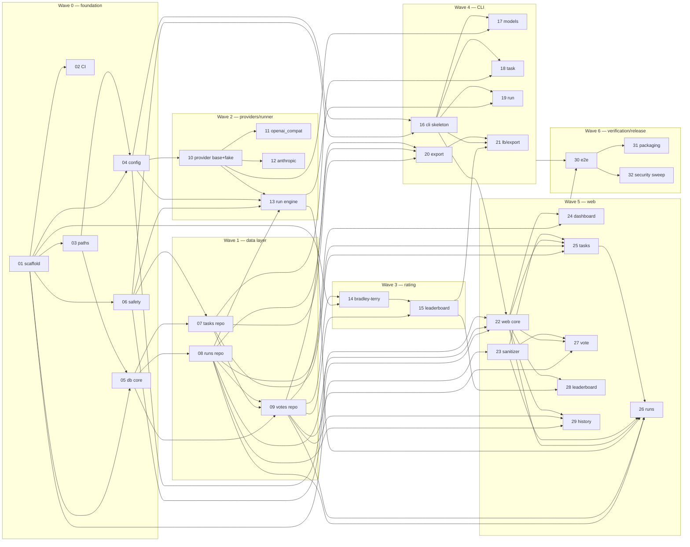

# mybench — v1 Issue Plan

Date: 2026-07-08
Status: Canonical execution plan derived from `docs/DESIGN.md`. GitHub Issues
are generated from `docs/issues/NN-*.md`; if they diverge, these files win.

## 1. v1 completion statement

v1 is complete when **all issues 01–32 are closed with their acceptance
criteria validated**. At that point a user can:

1. `uv tool install mybench` and run `mybench init`;
2. configure ≥ 2 models (OpenAI-compatible and/or Anthropic; keys via env
   vars only) and verify them with `mybench models check`;
3. add real tasks via CLI (args/stdin/file) or the web form;
4. execute a task against N models concurrently with timeouts, retries, and
   partial-failure tolerance;
5. vote on anonymized output pairs in the local web UI (127.0.0.1 only) with
   enforced blindness, least-voted-first scheduling, and reveal-after-vote;
6. view a Bradley-Terry leaderboard (bootstrap CIs, provisional flags,
   category filter, blind-only default) in web and CLI;
7. export all data to JSON/CSV;

with the §13 security controls implemented and verified (issue 32), CI
(lint + types + tests + coverage gates + pip-audit + build) green, and the
package installable from a built wheel. No product behavior exists outside
DESIGN.md; no DESIGN.md v1 behavior is missing from issues (coverage table §5).

## 2. Issue list in recommended execution order

| # | File | Title | Wave | Depends on |
|---|---|---|---|---|
| 01 | `issues/01-project-scaffold.md` | Project scaffold: uv package, src layout, tooling config | 0 | — |
| 02 | `issues/02-ci-pipeline.md` | CI pipeline: lint, types, tests, coverage, audit, build | 0 | 01 |
| 03 | `issues/03-xdg-paths.md` | Path resolution module with XDG + env overrides | 0 | 01 |
| 04 | `issues/04-config-loader.md` | Config schema, TOML loader, validation | 0 | 01, 03 |
| 05 | `issues/05-db-core-migrations.md` | SQLite core: connection policy, migration runner, schema 0001 | 0 | 01, 03 |
| 06 | `issues/06-safety-utils.md` | Safety utilities: limits, ANSI stripping, redaction, param validation | 0 | 01 |
| 07 | `issues/07-tasks-repository.md` | Tasks repository | 1 | 05, 06 |
| 08 | `issues/08-runs-outputs-repository.md` | Runs/outputs repository incl. reveal + orphan sweep | 1 | 05 |
| 09 | `issues/09-votes-repository-pair-selection.md` | Votes repository, pair selection, games extraction | 1 | 05, 07, 08 |
| 10 | `issues/10-provider-interface-fake.md` | Provider interface, error taxonomy, registry, fake provider | 2 | 04 |
| 11 | `issues/11-openai-compat-provider.md` | OpenAI-compatible provider adapter | 2 | 10 |
| 12 | `issues/12-anthropic-provider.md` | Anthropic provider adapter | 2 | 10 |
| 13 | `issues/13-run-engine.md` | Run execution engine | 2 | 04, 06, 08, 10 |
| 14 | `issues/14-bradley-terry-core.md` | Bradley-Terry MM estimator with regularization and components | 3 | 01, 09 |
| 15 | `issues/15-leaderboard-assembly.md` | Bootstrap CIs and leaderboard assembly | 3 | 09, 14 |
| 16 | `issues/16-cli-skeleton-init.md` | CLI skeleton: group, logging/redaction wiring, init/config/version | 4 | 04, 05, 06 |
| 17 | `issues/17-cli-models-commands.md` | CLI: models list / models check | 4 | 10, 16 |
| 18 | `issues/18-cli-task-commands.md` | CLI: task add / list / show | 4 | 07, 16 |
| 19 | `issues/19-cli-run-command.md` | CLI: run | 4 | 13, 16 |
| 20 | `issues/20-export-module.md` | Export module (JSON/CSV, 0600, no-overwrite) | 4 | 07, 08, 09 |
| 21 | `issues/21-cli-leaderboard-export.md` | CLI: leaderboard / export commands | 4 | 15, 16, 20 |
| 22 | `issues/22-web-core-security.md` | Web core: app factory, security middleware, base templates, serve cmd | 5 | 04, 05, 06, 08, 16 |
| 23 | `issues/23-markdown-sanitizer.md` | Markdown rendering + sanitization pipeline | 5 | 01 |
| 24 | `issues/24-web-dashboard.md` | Web: dashboard page | 5 | 09, 22 |
| 25 | `issues/25-web-task-pages.md` | Web: task list/create/detail/archive pages | 5 | 07, 08, 22, 23 |
| 26 | `issues/26-web-run-pages.md` | Web: run trigger, run detail w/ blindness rules, status polling, reveal | 5 | 08, 09, 13, 22, 23, 25 |
| 27 | `issues/27-web-vote-page.md` | Web: blind voting page + vote POST + reveal banner | 5 | 09, 22, 23 |
| 28 | `issues/28-web-leaderboard-page.md` | Web: leaderboard page | 5 | 15, 22 |
| 29 | `issues/29-web-history-pages.md` | Web: runs list, votes history, vote delete | 5 | 08, 09, 22 |
| 30 | `issues/30-e2e-suite.md` | End-to-end test suite over CLI + web with fake provider | 6 | 16–19, 21, 22–29 |
| 31 | `issues/31-packaging-release-readiness.md` | Packaging polish: README, CHANGELOG, LICENSE, wheel smoke test | 6 | 30 |
| 32 | `issues/32-security-acceptance-sweep.md` | Security acceptance sweep: verify every §13 control | 6 | 30 |

Within a wave, issues are parallelizable unless a dependency says otherwise.

## 3. Dependency graph

## 4. Implementation waves

| Wave | Goal / gate to advance |
|---|---|
| 0 — Foundation | Repo installs (`uv sync --dev`), CI green on a trivial test, config/db/safety primitives merged with unit tests |
| 1 — Data layer | All repositories merged; migrations apply on fresh DB; pair-selection unit tests pass |
| 2 — Providers & runner | Provider matrix tests green (MockTransport); `execute_run` produces correct terminal states incl. partial failure |
| 3 — Rating | BT known-answer + component + bootstrap tests green; §9.5 performance target measured and recorded in the PR |
| 4 — CLI | Full CLI usable end-to-end with fake provider (`init → task add → run → leaderboard → export`) |
| 5 — Web | Full web flow usable with fake provider; security middleware tests green; blindness leak tests green |
| 6 — Verification & release | e2e suite green in CI; wheel smoke test passes; issue 32 checklist fully verified |

## 5. Coverage table: DESIGN.md § → issues

| DESIGN section | Implemented by |
|---|---|
| §3.1 module layout | 01 (skeleton dirs), each module's issue |
| §4.1 connection policy | 05 |
| §4.2 migrations | 05 |
| §4.3 schema 0001 | 05 |
| §4.4 repositories | 07, 08, 09 |
| §5.1 paths | 03 |
| §5.2–5.3 config | 04 |
| §5.4 param validation | 06 (validators), used by 18/25/26 |
| §5.5 safety utils | 06 |
| §6.1–6.4 provider base/registry | 10 |
| §6.5 openai_compat | 11 |
| §6.6 anthropic | 12 |
| §6.7 fake | 10 |
| §6.8 transport policy | 10 (types/policy), 11, 12 (enforcement) |
| §7 run engine (7.4 sweep fn) | 13 (engine), 08 (sweep SQL), 16/22 (sweep wiring) |
| §8.1–8.3 pair selection | 09 |
| §8.4 display/vote recording | 27 |
| §8.5 blindness integrity | 08 (reveal), 09 (blind flag), 26, 27 |
| §8.6 leak checklist | 27, 32 |
| §9.1 games extraction | 09 |
| §9.2–9.4 estimator | 14 |
| §9.5 bootstrap | 15 |
| §9.6 assembly | 15 |
| §10.1 CLI global | 16 |
| §10.2 init | 16 |
| §10.3–10.4 models cmds | 17 |
| §10.5 task cmds | 18 |
| §10.6 run cmd | 19 |
| §10.7 serve cmd | 22 |
| §10.8 leaderboard cmd | 21 |
| §10.9 export | 20 (module), 21 (cmd) |
| §10.10 config/version cmds | 16 |
| §11.1 app factory | 22 |
| §11.2 routes | 24–29 (per table) |
| §11.3 templates | 22 (base/error), page issues |
| §11.4 static/JS | 22 (css), 26 (runstatus.js), 27 (vote.js) |
| §11.5 run-detail blindness | 26 |
| §11.6 runs_manager | 26 |
| §12 render pipeline | 23 |
| §13.1 B1 | 22 · B2: 22, 23 · B3: 06, 16–19 · B4: 10–12 · B5: 03, 05, 20 · B6: 01, 02, 22 · B7: 05–09, 24–29 |
| §13.2–13.5 web security | 22 |
| §13.6 secrets/content hygiene | 06, 10, 16, 20 |
| §13.7 filesystem perms | 03, 05, 20 |
| §13.8 abuse cases | 11, 12, 16–19, 22, 23 |
| §13.9 security acceptance | 32 |
| §14 logging/redaction | 06 (helpers), 16 (CLI wiring), 22 (web wiring) |
| §15 testing strategy | every issue (Validation sections), 30 |
| §16.1 packaging | 01, 31 |
| §16.2 CI | 02 |
| §16.3 versioning | 31 |
| §17 conventions | all issues (workflow requirements) |
| §18 known unknowns | §7 below |

## 6. Validation strategy (whole product)

1. **Per issue**: `uv run ruff check . && uv run ruff format --check . &&
   uv run mypy src && uv run pytest -q` must pass; each issue's Validation
   section lists concrete tests that must exist and pass. One issue = one PR;
   acceptance criteria are checked off in the PR description.
2. **Per wave**: gate condition in §4 table verified before starting the next
   wave (waves 2/3 may run in parallel after wave 1).
3. **Continuous**: CI (issue 02) blocks merges from wave 0 onward — lint,
   format, mypy, pytest with coverage gates (total ≥ 85%; `rating/*`,
   `web/security.py`, `web/render.py`, `safety.py` ≥ 95%), pip-audit, build.
4. **End-to-end** (issue 30): scripted user journeys over real HTTP with the
   fake provider; CLI journeys via CliRunner; both in CI.
5. **Security acceptance** (issue 32): every §13 control mapped to a passing
   test or written justification; blindness leak checklist re-verified.
6. **Release readiness** (issue 31): wheel built and installed into a clean
   venv; `mybench init → serve` smoke test from the installed package.

## 7. Known unknowns (may create additional issues)

Tracked in DESIGN §18 (U1–U8): OpenAI-compat `max_tokens` rejection (U1),
content-part arrays in the wild (U2), OpenRouter attribution headers (U3),
bootstrap performance at scale (U4), SQLite contention CLI+server (U5), port
8137 collisions (U6), Windows support (U7), graceful server-shutdown drain
(U8). Whoever hits one during implementation must open a new issue referencing
the U-number rather than silently expanding scope.

## 8. Deferred v2 items (not planned, recorded)

Per DESIGN §2.3: capture proxy, session-log importers, LLM-as-judge,
multi-turn tasks, streaming, style controls, cost estimation, import/merge,
syntax highlighting, Gemini native adapter, encrypted DB, team mode
(new ADR + auth design required), Windows support.
